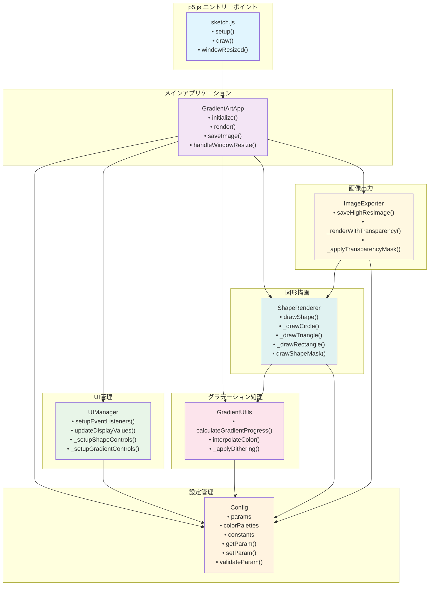

# リファクタリング後システム構成図

## 概要
このシステム構成図は、Blue Gradient Generatorのリファクタリング後のモジュール構成と依存関係を示しています。

## Mermaidコード

## 構成要素

- **sketch.js**: p5.jsのエントリーポイント、最小限のコード
- **GradientArtApp**: メインアプリケーションクラス、全体統制
- **Config**: 設定管理、パラメータ検証
- **UIManager**: ユーザーインターフェース管理
- **GradientUtils**: グラデーション計算とカラー処理
- **ShapeRenderer**: 図形描画ロジック
- **ImageExporter**: 高解像度画像出力 