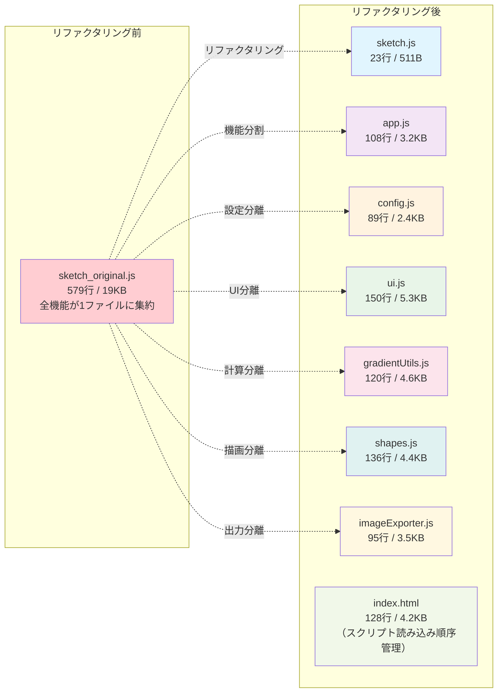

# リファクタリング前後のファイル構造比較

## 概要
このファイル構造比較図は、リファクタリング前の単一ファイルから、リファクタリング後の機能別分割ファイルへの変化を示しています。

## Mermaidコード

## 改善効果

### リファクタリング前の問題点
- **巨大なファイル**: 579行の単一ファイル
- **責任の混在**: 全機能が1箇所に集約
- **保守困難**: コードの理解・修正が困難
- **再利用不可**: モジュール化されていない

### リファクタリング後の利点
- **機能分離**: 各ファイルが明確な責任を持つ
- **適切なサイズ**: 100-150行程度の管理しやすいファイル
- **保守性向上**: 修正箇所の特定が容易
- **再利用可能**: モジュール単位での利用が可能

## ファイル詳細

| ファイル名 | 行数 | サイズ | 主な責任 |
|-----------|------|--------|----------|
| sketch.js | 23 | 511B | p5.jsエントリーポイント |
| app.js | 108 | 3.2KB | アプリケーション統制 |
| config.js | 89 | 2.4KB | 設定管理・検証 |
| ui.js | 150 | 5.3KB | UI制御・イベント処理 |
| gradientUtils.js | 120 | 4.6KB | グラデーション計算 |
| shapes.js | 136 | 4.4KB | 図形描画ロジック |
| imageExporter.js | 95 | 3.5KB | 画像出力・透過処理 | 