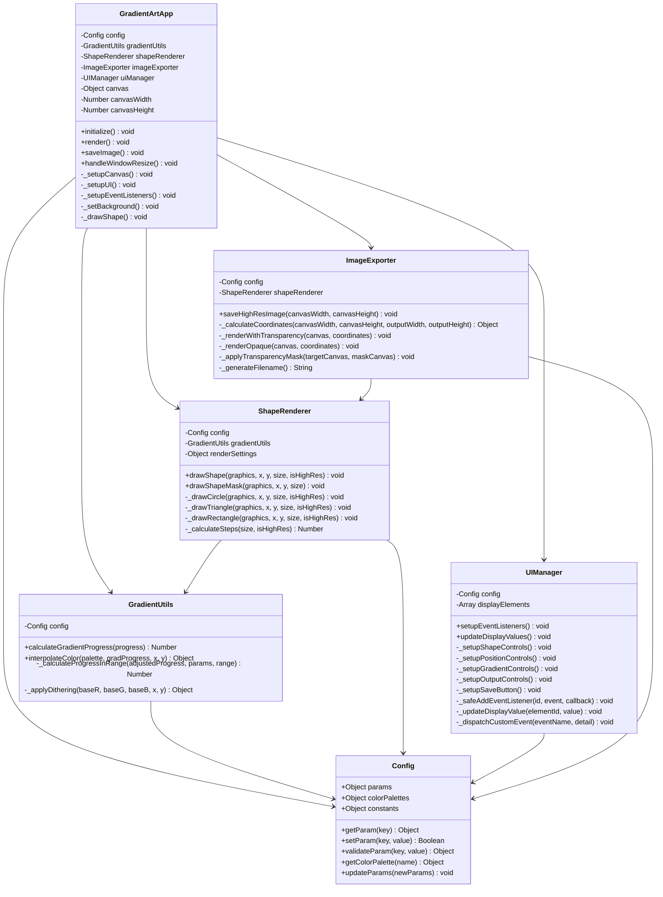

# クラス図（詳細設計）

## 概要
このクラス図は、リファクタリング後の各クラスの詳細な構造と依存関係を示しています。

## Mermaidコード

## クラス詳細説明

### Config（設定管理）
- **役割**: アプリケーション全体の設定とパラメータ管理
- **主要機能**: 
  - パラメータの取得・設定・検証
  - カラーパレット管理
  - 定数定義
- **特徴**: 全てのクラスから参照される中心的な設定クラス

### GradientUtils（グラデーション計算）
- **役割**: グラデーション計算とカラー補間処理
- **主要機能**:
  - グラデーション進行値の計算
  - カラー補間とディザリング
  - ループ・反転・オフセット処理
- **特徴**: 数学的計算を担当する純粋な処理クラス

### ShapeRenderer（図形描画）
- **役割**: 各種図形の描画処理
- **主要機能**:
  - 円・三角形・四角形の描画
  - 高解像度レンダリング
  - マスク描画（透過処理用）
- **特徴**: p5.jsの描画機能を抽象化したレンダリングクラス

### UIManager（UI管理）
- **役割**: ユーザーインターフェースの制御
- **主要機能**:
  - イベントリスナーの設定
  - UI要素の値更新
  - 安全なDOM操作
- **特徴**: UIとロジックの分離を実現するインターフェースクラス

### ImageExporter（画像出力）
- **役割**: 高解像度画像の生成と保存
- **主要機能**:
  - 高解像度レンダリング
  - 透過背景処理
  - ファイル名生成と保存
- **特徴**: 複雑な画像処理を専門に扱うエクスポートクラス

### GradientArtApp（メインアプリケーション）
- **役割**: アプリケーション全体の統制と制御
- **主要機能**:
  - 各コンポーネントの初期化
  - 描画ループの管理
  - ウィンドウリサイズ対応
- **特徴**: 全てのクラスを統合する中央制御クラス

## 設計パターン

- **Facade Pattern**: GradientArtAppが複雑なサブシステムを隠蔽
- **Strategy Pattern**: ShapeRendererが図形描画の戦略を切り替え
- **Observer Pattern**: UIManagerがイベント駆動でConfig更新を通知
- **Dependency Injection**: 各クラスが必要な依存関係を注入で受け取り 